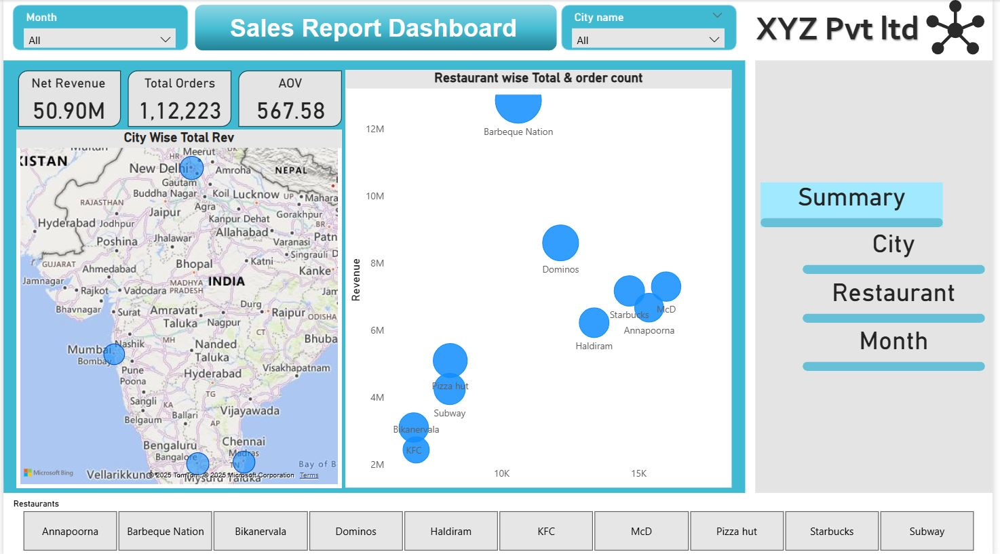
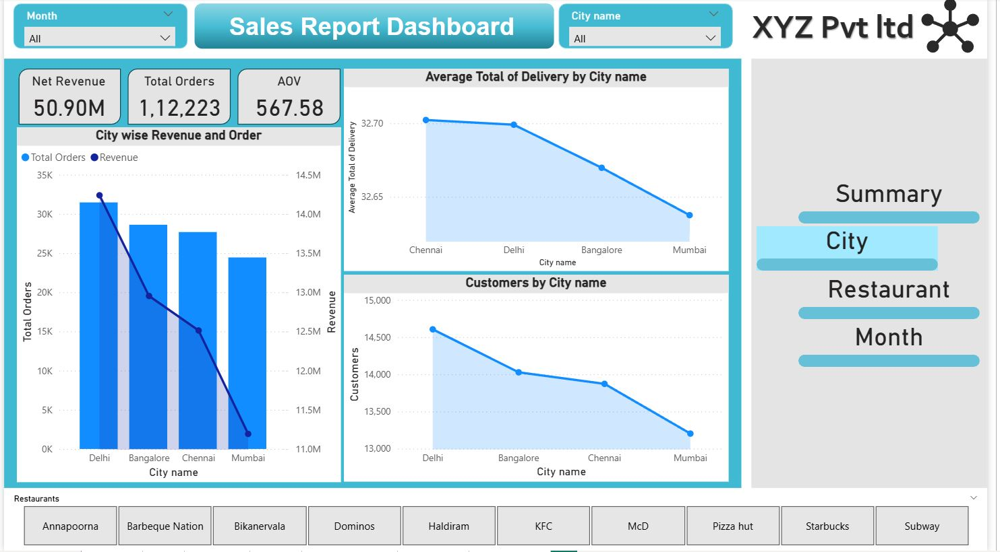
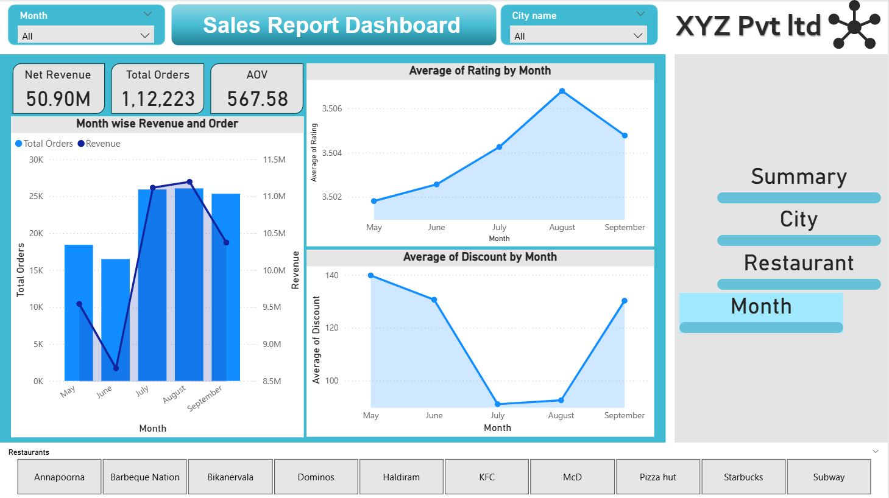
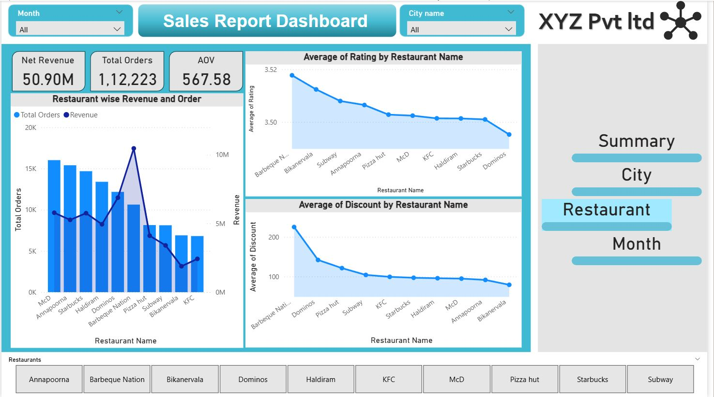

# 📊 Sales Report Dashboard – Power BI

## 📌 Overview
This Power BI Sales Report Dashboard provides a comprehensive analysis of sales, revenue, orders, customer behavior, and performance across **cities, months, and restaurants**.  
It is designed to help stakeholders monitor key business metrics and identify trends that support data-driven decision-making.

---

## 🧾 Key Metrics (KPIs)
- **Net Revenue:** 50.90M  
- **Total Orders:** 112,223  
- **Average Order Value (AOV):** 567.58  

These KPIs update dynamically based on selected filters such as **City, Month, and Restaurant**.

---

## 🗂️ Dashboard Sections

### 1️⃣ Overall Summary

**Insights:**
- High-level view of total revenue, order volume, and AOV.
- Acts as a quick snapshot for business performance monitoring.
- Enables instant understanding of overall sales health.

---

### 2️⃣ City-wise Analysis

**Visuals Included:**
- City-wise Revenue & Order Count  
- Average Delivery Time by City  
- Customers Count by City  
- Geographic Revenue Distribution (Map View)

**Insights:**
- Delhi and Bangalore contribute the highest revenue and orders.
- Mumbai has relatively lower customer count and delivery performance.
- Helps identify top-performing and underperforming cities.

---

### 3️⃣ Month-wise Analysis

**Visuals Included:**
- Month-wise Revenue and Orders
- Average Customer Rating by Month
- Average Discount by Month

**Insights:**
- Revenue peaks during July and August.
- Ratings gradually improve over time, with highest in August.
- Discount trends correlate with order volume spikes.

---

### 4️⃣ Restaurant-wise Analysis

**Visuals Included:**
- Restaurant-wise Revenue and Order Count
- Average Rating by Restaurant
- Average Discount by Restaurant

**Insights:**
- Barbeque Nation and Domino’s generate strong revenue.
- Restaurants with higher discounts show increased order volume.
- Helps compare restaurant performance and customer satisfaction.

---

## 🎯 Filters & Interactivity
- **City**
- **Restaurant**
- **Month**

All visuals are interconnected to allow deep-dive analysis through dynamic filtering and drilldowns.

---

## 🛠️ Tools & Technologies
- **Power BI**
- **DAX Measures**
- **Data Modeling**
- **Interactive Visuals**
- **Geographic Map Visualizations**

---

## ✅ Key Outcomes
- Improved visibility into sales performance
- Identification of high- and low-performing cities and restaurants
- Clear understanding of seasonal trends
- Actionable insights for revenue and discount optimization

---

## 📁 File Information
- **Power BI File:** `Rest_dashboard.pbix`
- **Screenshots:** Included for overview and analysis clarity

---

## 🙌 Conclusion
This dashboard showcases strong analytical thinking, data visualization best practices, and real-world business insight extraction using Power BI.  
It is suitable for stakeholders, analysts, and decision-makers seeking a clear and interactive sales performance overview.

---

📬 *Feel free to explore, provide feedback, or connect with me for collaboration!*
